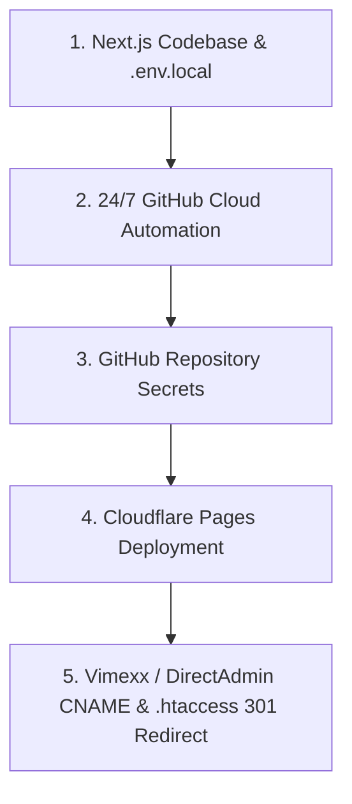

# 🚀 Blueprint: Next.js + Cloudflare Pages + 24/7 Autopilot Automation

Dit document is de complete, herbruikbare handleiding voor het opzetten van nieuw te bouwen Next.js affiliate & content websites met 100% gratis Cloudflare Pages hosting en 24/7 geautomatiseerde AI-content & API-synchronisatie.

---

## 📋 Het Masterplan voor Nieuwe Websites



---

## 🔹 Stap 1: Omgevingsvariabelen & Next.js Static Export

### 1. Lokaal `.env.local` bestand aanmaken in de hoofdmap
```env
DEEPSEEK_API_KEY=your_deepseek_api_key_here
BOL_CLIENT_ID=your_bol_client_id_here
BOL_CLIENT_SECRET=your_bol_client_secret_here
```

### 2. `next.config.mjs`
```javascript
/** @type {import('next').NextConfig} */
const nextConfig = {
  output: 'export',
  images: {
    unoptimized: true,
  },
};

export default nextConfig;
```

### 3. `src/app/robots.js` & `src/app/sitemap.js`
Voeg bovenaan beide bestanden toe:
```javascript
export const dynamic = 'force-static';
```

---

## 🔹 Stap 2: 24/7 Cloud Automatisering (GitHub Actions)

### 1. `scripts/generate-article.js`
Script dat de DeepSeek API roept volgens de 8 kwaliteitsregels (definitie opening, veiligheidskader, voor- en nadelen, partnerlink-disclaimers, schone interne links).

### 2. `update-bol-prices.js` & `scripts/discover-products.js`
Scripts die via de Bol API live prijzen, voorraden, haarscherpe foto's en breukvrije affiliate-zoeklinks ophalen en 1 tot 2 nieuwe topproducten per run toevoegen aan de 5 JSON-categorieën (`power.json`, `accessoires.json`, `daktenten.json`, `dakdragers.json`, `fietsendragers.json`).

### 3. `.github/workflows/cron-blog.yml`
```yaml
name: 24/7 Automated Blog Publisher & Bol API Sync

on:
  schedule:
    - cron: '0 9 */3 * *' # Elke 3 dagen om 09:00 UTC
  workflow_dispatch:

jobs:
  generate-and-publish:
    runs-on: ubuntu-latest
    steps:
      - uses: actions/checkout@v4
      - uses: actions/setup-node@v4
        with:
          node-version: 20
      - run: npm ci || npm install
      - run: node scripts/discover-products.js || true
        env:
          BOL_CLIENT_ID: ${{ secrets.BOL_CLIENT_ID }}
          BOL_CLIENT_SECRET: ${{ secrets.BOL_CLIENT_SECRET }}
      - run: node update-bol-prices.js || true
        env:
          BOL_CLIENT_ID: ${{ secrets.BOL_CLIENT_ID }}
          BOL_CLIENT_SECRET: ${{ secrets.BOL_CLIENT_SECRET }}
      - run: node scripts/generate-article.js
        env:
          DEEPSEEK_API_KEY: ${{ secrets.DEEPSEEK_API_KEY }}
      - run: npm run build
      - run: |
          git config --global user.name "Automated Publisher Bot"
          git config --global user.email "bot@deautokampeerder.nl"
          git add src/data/ src/content/kennisbank/
          git diff --quiet && git diff --staged --quiet || (git commit -m "feat(cron): sync live Bol prices, discover products & publish article" && git push)
```

---

## 🔹 Stap 3: GitHub Repository Secrets Toevoegen

In de GitHub Repository ➔ **Settings** ➔ **Secrets and variables** ➔ **Actions**:
- `DEEPSEEK_API_KEY`: API Key uit `.env.local`
- `BOL_CLIENT_ID`: Client ID uit `.env.local`
- `BOL_CLIENT_SECRET`: Client Secret uit `.env.local`

---

## 🔹 Stap 4: Cloudflare Pages Koppelen (100% Gratis & Onbeperkt)

1. Log in op [Cloudflare Dashboard](https://dash.cloudflare.com/) ➔ **Workers & Pages** ➔ **Create Application** ➔ **Pages** ➔ **Connect to Git**.
2. Selecteer de GitHub repository.
3. Instellingen:
   - **Framework preset:** `Next.js (Static HTML Export)`
   - **Build command:** `npx next build` *(of `npm run build`)*
   - **Build output directory:** `out`
4. Klik op **Save and Deploy**.
5. Ga naar **Custom domains** ➔ Voeg `www.domeinnaam.nl` toe ➔ Kies **My DNS provider** ➔ **Begin CNAME setup**.

---

## 🔹 Stap 5: Vimexx / DirectAdmin DNS, SSL & 301 Redirect

In het DirectAdmin beheer van de provider (Vimexx):

1. **DNS Management:**
   - **`www` CNAME:** `<projectnaam>.pages.dev.` *(met de punt aan het einde!)*
   - **Hoofddomein A-record:** `185.104.29.70` *(wijst naar Vimexx server)*
   - **E-mail (MX, TXT, mail, smtp):** 100% ongewijzigd laten.

2. **SSL Certificaat bij Vimexx (voorkomt Bitdefender SSL waarschuwing):**
   - DirectAdmin ➔ **Advanced Features** ➔ **SSL Certificates**.
   - Kies **Free & automatic certificate from Let's Encrypt**.
   - Vink het domein aan en sla op.

3. **.htaccess 301 Redirect (stuur non-www naar www):**
   - DirectAdmin ➔ **File Manager** ➔ `domains/domeinnaam.nl/public_html/`.
   - Bewerk of maak het bestand **`.htaccess`** en plaats deze regel:
     ```apache
     Redirect 301 / https://www.domeinnaam.nl/
     ```

---

### ✅ Eindresultaat:
- ⚡ 100% Gratis onbeperkte hosting & SSL via Cloudflare Pages.
- 📧 100% E-mailbehoud bij Vimexx zonder storingen.
- 🔒 100% Geldig groen SSL-slotje voor zowel met als zonder `www`.
- 🤖 24/7 Autopilot: automatische artikelen, live prijzen en productuitbreiding.
- 📱 Perfect responsive magazine-layout en zoekmachine-geoptimaliseerd!
